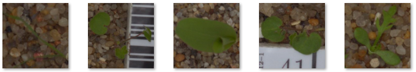
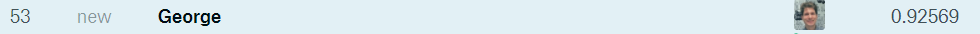

_Disclaimer: this project was completed long time ago **during my time in academia**._

# Fine-Tuned VGG-16 on seedlings dataset

For this project, I picked a nontrivial dataset of small and large square pictures of seedlings ("baby"-plants). The goal is to recognize if the seedling on a photo belongs to one of 12 different species. The dataset is part of a Kaggle competition ([link](https://www.kaggle.com/c/plant-seedlings-classification))

For this task, I used a VGG-16 CNN architecture. The model was imlemented in Keras.

<div>

</div>

## Performance

After the fine-tuning, the model has been trained for 72 epochs on a GPU. The result is **92.57% accuracy on a test set**.

Kaggle score:
<div>

</div>

> **Accuracy**
> - Train:  91.98% (with continuous random augmentation)
> - Dev:    92.33%
> - Test:   92.57%

> **Layers in the network**
> - VGG-16 (no top FC layers)
> - FC, 1152 units
> - FC, 12 units (output)

**Challenges:**

- The dataset is small-medium size (4050 training examples, 700 validation examples, 700 test examples)
- Images are very similar.
- Images come at different sizes, ranging from 70x70 to 1000x1000.

**Solutions:**

- Use data augmentation (rotation, flipping, small affine transformations).
- Use deep convolutional network pretrained on ImageNet data set.
- Fine-tune the last convolutional layers and retrain fully-connected layers.

**Project stages:**

1. Convert immages into a training array of size ```(m, 224, 224, 3)```, where ```m``` - number of training examples.
2. Remove final dense layers form VGG-16 and calculate bottleneck features in the last remaining layer using the training array.
3. Train a Fully Connected Network with 2 layers using the pre-calulated bottleneck features and appropriate data labels.
4. Join reduced VGG-16 and Fully Connected Network and fine tune last 3 convolutional layers together with fully-connected layers using original images.

## Potential improvements
Looking at accuracy (below) it is obvious that the mode has high **bias**. This is due to high similarity of the data and disproportionate rescaling. Since all images are of the different size (from 70x70 to 1000x1000), it is not sensible to rescale them all to 224x224 size and train one network on them. Therefore, in the next steps in the project, the data will be separated by the image size and several neural networks will be trained in parallel on each size bin. This is expected to decrease the dev error further.
